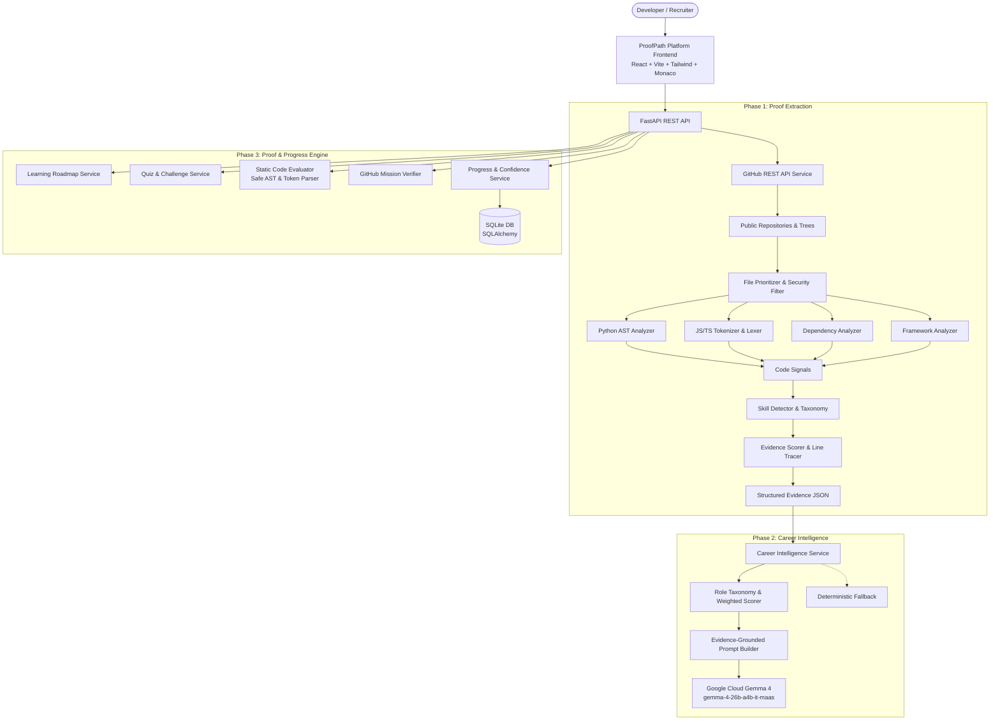

# ProofPath

> **Deterministic Skill Proof Extraction Engine & Career Readiness Platform**  
> *Core Principle: NO EVIDENCE → NO CLAIM*  
> *Motto: Code proves. AI interprets. GitHub verifies.*

---

## Team

**Team Name:** Rebels  
**Hackathon:** Hacktoberfest Hack Day — Coimbatore 2026 (INIT CLUB × iDEA CLUB × MLH)

| Member | Contribution |
| ------ | ------------ |
| Varun Shankar | Team Leader & System Design |
| Dheeraj Kumar Reddy | Core Backend, AST Analyzers & Evidence Engine |
| Vishnu Vardhan Reddy | API Integration, Career Service & Testing |
| Mohith Kumar Naidu | Skill Taxonomy, Roles Architecture & Gemma 4 Integration |

---

## Problem Statement

### The Problem
Traditional developer resumes, LinkedIn profiles, and GitHub summaries rely on self-declared claims, copy-pasted keywords, and unverified badges. Tech recruiters and engineering managers waste hundreds of hours reviewing candidates who list technologies they barely understand or copied from boilerplate repositories. Meanwhile, generic LLM-based profile summarizers naively scan README files, hallucinating technical competence where no working code exists.

Even when candidates identify their gaps, the path to closing them is broken: standard platforms present passive video tutorials without testing code reasoning, interactive implementation, or verifying actual repository commits.

### Why We Selected This Problem
Software engineering is inherently practical. An engineer's competence is reflected in the code they write — how they design modules, structure classes, handle errors, optimize algorithms, write unit tests, and configure production environments.

We built ProofPath to provide:
1. A **tamper-resistant, deterministic verification engine** that replaces unverified claims with verifiable code evidence.
2. **Career intelligence** powered by Google Cloud Managed Gemma 4 that maps verified skills to industry roles.
3. A complete **proof-and-progress loop** that pinpoints exact skill gaps, provides curated learning resources, tests knowledge, evaluates code implementations statically, and verifies practical repository missions to build verifiable career confidence.

---

## Solution

ProofPath inspects a developer's public GitHub repositories, deterministically extracts technical evidence directly from source code, maps those skills to industry career roles, and provides an end-to-end learning and verification ecosystem.

### Complete End-to-End Loop

```text
       GitHub Profile & Public Repositories
                        ↓
      Source Code AST & Static Analysis
                        ↓
        Deterministic Evidence Extraction (Phase 1)
       (Level 0–5 Calibrated, Exact Line Traceability)
                        ↓
            Career Role Intelligence (Phase 2)
      (Proven / Partial / Missing, Weighted Readiness)
                        ↓
          Google Cloud Managed Gemma 4
        (Evidence-Grounded Interpretations)
                        ↓
              Proof & Progress (Phase 3)
      ┌─────────────────┴─────────────────┐
      │  Curated Technical Learning Path  │
      │  Knowledge Assessment (MCQs)      │
      │  Code Reasoning & Implementation  │
      │  Practical Repository Missions    │
      └─────────────────┬─────────────────┘
                        ↓
             Static GitHub Verification
                        ↓
       Tri-Pillar Skill Confidence (40 / 30 / 30)
                        ↓
    Developer Career Readiness Dashboard (Phase 4)
```

### Tri-Pillar Skill Confidence Formula

Unlike arbitrary scores, ProofPath computes skill confidence using a deterministic tri-pillar composite formula:

$$\text{Skill Confidence} = (\text{Code Evidence} \times 0.40) + (\text{Knowledge Quiz} \times 0.30) + (\text{Practical Ability} \times 0.30)$$

- **Code Evidence (40%):** Grounded directly in physical repository code (calibrated from Level 0 to Level 5).
- **Knowledge Quiz (30%):** Graded via deterministic multi-choice technical assessments.
- **Practical Ability (30%):** Average of interactive code implementation challenges and statically verified GitHub repository missions.

---

## Innovation and Differentiation

| Feature | Conventional Resume/AI Platforms | ProofPath |
| ------- | --------------------------------- | --------- |
| **Evidence Basis** | Self-reported keywords or READMEs | Physical repository source code |
| **Analysis Method** | LLM summarization (hallucinates) | Deterministic AST, tokenizer & manifest parsing |
| **Traceability** | None (opaque claims) | Exact repository file paths and line ranges |
| **Dependency Weight** | Treated as full competence | Strictly Level 2 (Partial Evidence) |
| **Career Readiness** | Subjective keyword match | Mathematically weighted scoring (Core 2.0x, Supporting 1.0x) |
| **AI Role** | Generates claims from thin air | Strictly interprets pre-verified code evidence |
| **Code Evaluation** | Unsafe sandbox or none | Safe static AST/regex analysis (Zero `eval()` / `exec()`) |
| **Skill Progression** | Passive certificates | Tri-pillar verified confidence (40% Code, 30% Quiz, 30% Practical) |
| **AI Resilience** | System breaks if LLM errors | Graceful deterministic fallback ensures 100% uptime |
| **Mission Verification** | Unverified checkmarks | Real GitHub repository static code verification |

---

## Technical Implementation

### System Architecture



### Technology Stack

| Layer | Technologies |
| ----- | ------------ |
| **Frontend** | React 18, TypeScript, Vite, Tailwind CSS, Monaco Editor (`@monaco-editor/react`), Lucide React |
| **Backend** | Python 3.10+, FastAPI, Uvicorn, Pydantic v2, SQLAlchemy 2.0 (SQLite) |
| **HTTP Clients** | HTTPX (async client with timeouts, retry logic, and rate-limit handling) |
| **Static Code Parsing** | Python `ast`, Regex Lexer, JSON/TOML parsers, Dockerfile parser |
| **AI Model** | Google Cloud Managed Gemma 4 (`gemma-4-26b-a4b-it-maas`, location: `global`) |
| **Database** | SQLite (`proofpath.db`) via SQLAlchemy ORM |
| **Testing** | Pytest, Pytest-Asyncio (75 automated unit & integration tests, 100% passing) |

---

## Implementation During the Hackathon

The Rebels team built all 4 phases during the Hack Day:

### Phase 1: Proof Extraction Engine
- **GitHub Pipeline:** Asynchronous `GitHubService` with recursive Git tree queries and rate-limit adaptation.
- **AST Code Analyzers:** Python AST analyzer checking class inheritance, decorators, training loops, and library calls without code execution.
- **JavaScript & TypeScript Tokenizer:** Parser for React hooks, TS interfaces, Express routes, and Next.js structures.
- **Dependency & Manifest Engine:** Analyzes `requirements.txt`, `package.json`, `pyproject.toml`, and `Dockerfile`.
- **Evidence Calibration:** Calibrated 0–5 scoring scale with exact file path and line number traceability.

### Phase 2: Career Intelligence & Gemma 4
- **Career Roles Architecture:** 6 industry roles with core (2.0x) and supporting (1.0x) weights in `data/roles.json`.
- **Deterministic Readiness Scorer:** Computes weighted role readiness (0–100%) and categorizes skills into Proven, Partial, or Missing.
- **Google Cloud Managed Gemma 4:** Integrated `gemma-4-26b-a4b-it-maas` with strict prompt guardrails ensuring AI never alters readiness scores or fabricates evidence.
- **Deterministic Fallback:** Robust fallback mode that produces grounded assessments even when AI is unconfigured or offline.

### Phase 3: Proof & Progress Engine
- **Static Code Evaluator:** 100% safe, deterministic code evaluator using AST inspections and token validation. Zero `eval()` or `exec()`.
- **3-Dimension Assessment Catalog:** Knowledge MCQs, Code Reasoning questions, Code Implementation specs, and Practical Missions across core skills.
- **Curated Learning Paths:** Gap-prioritized learning roadmaps linking directly to official documentation, guides, and tutorials.
- **Static GitHub Mission Verifier:** Reuses Phase 1 AST analyzers to inspect candidate repositories and verify completed missions.
- **Tri-Pillar Confidence Tracker:** Formula-driven composite confidence scoring with SQLite persistence.
- **Next Best Action Generator:** Data-driven prioritization engine recommending the highest-impact action to advance career readiness.

### Phase 4: Career Readiness Platform (Frontend)
- **Developer-First UI:** Clean, linear-aesthetic dashboard built with React, Vite, and Tailwind CSS.
- **Dark/Light Mode:** Seamless theme toggle with high-contrast accessibility tokens and `localStorage` persistence.
- **Interactive Readiness Meter:** Visualizes overall readiness score and Core vs. Supporting breakdown.
- **Skill Confidence Cards:** Shows 5-dot strength meters, Proven/Partial/Missing badges, and direct CTAs to Learn, Quiz, or Code.
- **Monaco Code Editor:** Embedded VS Code editor (`@monaco-editor/react`) for completing live code implementation challenges with instant static feedback.
- **Evidence Drawer:** Traceable code viewer inspecting exact file paths, line numbers, and extracted signals.
- **Learning Roadmap & Mission Verification:** Step-by-step curriculum with real technical links and repository verification submission.

### Product Quality & Assessment Engine Pass
- **Adaptive Assessment Engine & 2,520-Question Bank:** 105 validated questions per skill across all 24 skills (Beginner, Intermediate, Advanced, Expert) with streak-based dynamic difficulty leveling (streak $\ge 2$ correct promotes difficulty, errors demote).
- **Mathematical Foundations:** Added Linear Algebra, Multivariate Calculus, Probability, and Optimization into skills and ML/AI career roles (`ml_engineer`, `data_scientist`, `ai_engineer`).
- **Real GitHub Profile & Repository Explorer:** Live profile card (avatar, bio, total vs. analyzed public repos) and repository explorer tab with stars, forks, files scanned, and detected skills.
- **Coverage Transparency Banner:** Clear statement ("Analyzed X of Y public repositories, excluding forks & non-code") ensuring complete honesty and reproducibility.
- **High-Quality Curated Learning Resources:** 42 verified resources with official documentation and top technical English YouTube creators (3Blue1Brown, StatQuest, FreeCodeCamp, Traversy Media, sentdex).

---

## Open Source and AI Usage

### AI / Models
- **Google Cloud Managed Gemma 4 (`gemma-4-26b-a4b-it-maas`):**
  - **Role:** Generates evidence-grounded qualitative career insights (strengths, gaps, career advice) based solely on verified Phase 1 code signals.
  - **Deployment:** Google Cloud Vertex AI Model Garden / MaaS (`global` location).
  - **Grounding Guardrails:** Gemma is strictly prohibited from altering deterministic readiness scores or inventing unverified skill claims.
  - **Fallback:** Complete offline deterministic fallback when AI is unavailable.

### Open Source Components
- **FastAPI & Uvicorn:** REST API routing and asynchronous ASGI server.
- **Pydantic v2:** Strict request/response validation and serialization.
- **SQLAlchemy:** ORM layer for tracking assessments, progress, and user profiles.
- **React 18 & Vite:** Modern, fast frontend build tooling and component rendering.
- **Tailwind CSS:** Developer-focused, accessible styling system.
- **Monaco Editor (`@monaco-editor/react`):** Browser-based VS Code editing experience.
- **Lucide React:** Lightweight, clean icon set.
- **Pytest & Pytest-Asyncio:** Unit and integration test suite.

---

## Setup and Usage

### Prerequisites
- Python 3.10+
- Node.js 18+ and npm
- Git

### 1. Clone & Setup Backend

```bash
git clone <repository-url>
cd hack

# Create and activate virtual environment
python -m venv .venv

# Windows PowerShell:
.\.venv\Scripts\Activate.ps1

# Linux / macOS:
source .venv/bin/activate

# Install backend dependencies
pip install -r backend/requirements.txt
```

### 2. Configure Environment Variables
Copy `.env.example` to `.env`:
```env
# GitHub Configuration
GITHUB_TOKEN=your_optional_github_token_here
PORT=8000

# Limits
MAX_REPOSITORIES=5
MAX_FILES_PER_REPOSITORY=40
MAX_FILE_SIZE=100000
MAX_TOTAL_SOURCE_SIZE=1000000
GITHUB_API_TIMEOUT=15.0

# Google Cloud Managed Gemma 4 Configuration
GOOGLE_CLOUD_PROJECT=your-project-id
GOOGLE_CLOUD_LOCATION=global
GEMMA_MODEL=gemma-4-26b-a4b-it-maas
GEMMA_API_KEY=your_optional_gemma_api_key
GEMMA_TIMEOUT=30.0
```

### 3. Setup Frontend

```bash
cd frontend
npm install
cd ..
```

### 4. Running the Complete Application

**Terminal 1 — Backend:**
```bash
# Windows PowerShell
$env:PYTHONPATH="backend"
.\.venv\Scripts\uvicorn app.main:app --reload --port 8000

# Linux / macOS
PYTHONPATH=backend uvicorn app.main:app --reload --port 8000
```
*Backend API will be live at `http://localhost:8000` (Docs: `http://localhost:8000/docs`).*

**Terminal 2 — Frontend:**
```bash
cd frontend
npm run dev
```
*Frontend application will be live at `http://localhost:5173`.*

---

## Running Automated Tests

Run the full suite of **68 tests** covering all phases:

```bash
# Windows PowerShell
$env:PYTHONPATH="backend"
.\.venv\Scripts\python -m pytest backend/tests -v

# Linux / macOS
PYTHONPATH=backend pytest backend/tests -v
```

---

## API Endpoints

### Phase 1 & 2: Proof & Career Intelligence
- `GET /health` — Health check & system status
- `POST /api/github/analyze` — Deterministic GitHub repository analysis & proof extraction
- `GET /api/analysis/roles` — List supported career roles
- `GET /api/analysis/roles/{role_id}` — Get details and skill requirements for a role
- `POST /api/analysis/career` — Run end-to-end career analysis with Gemma 4 interpretation

### Phase 3: Proof & Progress Engine
- `GET /api/quiz/generate?skill={skill}&role_id={role_id}` — Generate 3-dimension skill assessment
- `POST /api/quiz/submit` — Submit MCQ knowledge quiz for deterministic grading
- `POST /api/code-challenges/submit` — Submit code challenge for safe static AST evaluation
- `GET /api/learning/{skill}` — Retrieve curated learning resources for a skill
- `GET /api/learning-path/{role_id}` — Generate prioritized learning roadmap for a career role
- `POST /api/tasks/verify` — Statically verify a GitHub repository against a practical mission
- `GET /api/progress/{username}` — Get comprehensive progress & tri-pillar confidence breakdown
- `GET /api/recommendations/{username}?role_id={role_id}` — Get data-driven Next Best Actions

---

## Demonstration Walkthrough

1. **Enter GitHub Profile:**
   - Launch the frontend at `http://localhost:5173`.
   - Enter a GitHub username (e.g., `torvalds` or your own username) and select a target career role (e.g., `Backend Engineer`).
   - Click **Analyze Profile & Build Proof**.

2. **Inspect Career Readiness Dashboard:**
   - View the calculated **Readiness Meter** showing total readiness percentage, Core skills readiness (2.0x weight), and Supporting skills readiness (1.0x weight).
   - Review the **Google Cloud Gemma 4** grounded AI assessment detailing your verified strengths and primary gaps.

3. **Explore Code Evidence:**
   - On any skill card (e.g., `Python`), click **View Evidence**.
   - Inspect the exact repository, file path, line numbers, and extracted signals that prove the skill.

4. **Take a Skill Assessment:**
   - Click **Take Assessment** on a skill card.
   - Answer the Knowledge MCQs and Code Reasoning questions.
   - Write real code in the embedded **Monaco Editor** to solve the Code Challenge.
   - Click **Evaluate Code** to receive instant, safe static AST feedback.

5. **Follow Curated Learning & Mission:**
   - Navigate to the **Learning Path** tab to review the gap-prioritized roadmap.
   - Access official documentation and tutorials.
   - Submit a practical repository mission for static verification on GitHub.

6. **Track Composite Confidence:**
   - Switch to the **Skill Confidence** tab to see your updated 40/30/30 composite confidence score advancing from missing/partial to proven.

---

## Challenges and Learnings

- **Rate Limit Constraints:** GitHub restricts unauthenticated REST requests to 60/hour. We resolved this by querying the Git Trees API recursively (1 request per repo rather than 1 request per directory) and supporting token-based requests.
- **Safe Code Evaluation Without Execution:** Evaluating candidate code in hackathons without full Docker sandboxing is dangerous. We innovated by developing a static AST and token evaluator that safely checks AST node types, functions, parameter names, and syntax without ever calling `eval()` or `exec()`.
- **AI Hallucination Containment:** LLMs tend to assume full competency from simple keywords. We constrained Gemma 4 strictly to pre-extracted code evidence and enforced an automatic deterministic fallback when external AI is offline.
- **Tri-Pillar Formula Balance:** Bridging repository evidence with active assessments required balanced weighting. The 40% Code / 30% Quiz / 30% Practical formula ensures neither pure theoretical test-taking nor unmaintained legacy repositories dominate a developer's readiness score.

---

## Credits and License

### Credits
- Built for **Hacktoberfest Hack Day — Coimbatore 2026** organized by INIT CLUB × iDEA CLUB in collaboration with Major League Hacking (MLH).
- Inspired by the open-source software verification community and the principle of evidence-based hiring.

### License
This project is licensed under the MIT License.
