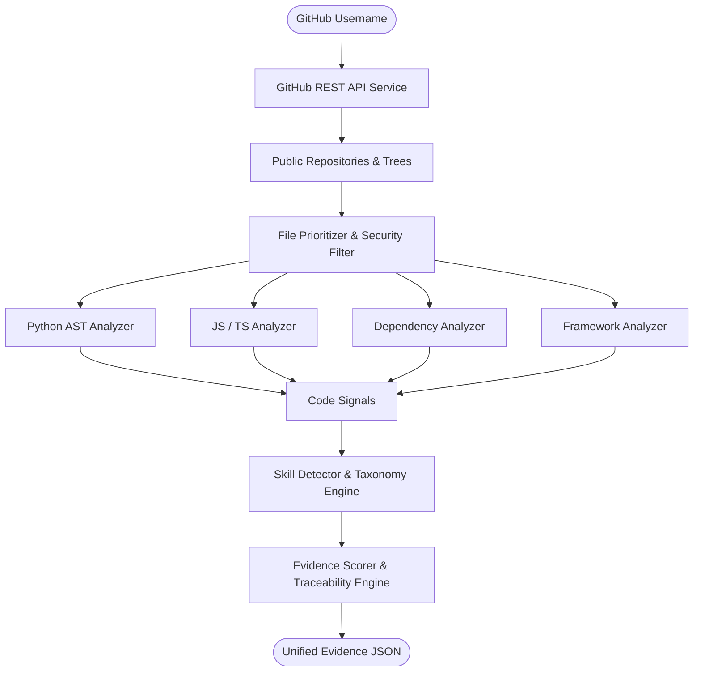

# ProofPath

> **Deterministic Skill Proof Extraction Engine from GitHub Repositories**  
> *Core Principle: NO EVIDENCE → NO CLAIM*

---

## Team

**Team Name:** Rebels

| Member | Contribution |
| ------ | ------------ |
| Varun Shankar | Team Leader & System Design |
| Dheeraj Kumar Reddy | Core Backend, AST Analyzers & Evidence Engine |
| Vishnu Vardhan Reddy | API Integration, GitHub Service & Testing |
| Mohith Kumar Naidu | Skill Taxonomy & Dependency Extraction |

---

## Problem Statement

### The Problem
Traditional developer resumes, LinkedIn profiles, and GitHub summaries rely on self-declared claims and unverified badges. Tech recruiters and engineering managers waste significant time reviewing candidates who list technologies they barely used or only copied from starter templates. Furthermore, LLM-based profile summary tools often summarize README text files blindly, hallucinating proficiency where no real code exists.

### Why We Chose This Problem
Software engineering is inherently practical. An engineer's real competence is reflected in the code they write, how they design classes, import libraries, configure pipelines, and test software. We chose this problem to build a tamper-resistant, deterministic verification engine that bridges candidate claims with verifiable code evidence.

---

## Solution

ProofPath inspects a developer's public GitHub repositories and deterministically verifies technical skills directly against their source code.

### Core Architecture Flow
```text
GitHub Profile
      ↓
Public Repositories
      ↓
Repository File Trees
      ↓
Security & Binary Filtering
      ↓
Source Code Analysis (Python AST, JS/TS Tokenizer, Manifests)
      ↓
Signal Extraction & Aggregation
      ↓
Skill Taxonomy Matching
      ↓
Evidence Level Scoring & Line Traceability
      ↓
Unified Evidence JSON
```

### Key Features
- **Deterministic AST Analysis:** Uses Python's built-in `ast` module to analyze class inheritance, function calls, training loops, and API decorators without executing code.
- **JavaScript & TypeScript Extraction:** Parses React components, hooks, Express handlers, TypeScript types, and async workflows.
- **Calibrated Evidence Scale (0–5):** Distinguishes between documentation mentions (Level 1), dependency manifests (Level 2), code implementation (Level 3), applied integration (Level 4), and production readiness (Level 5).
- **Exact Line Traceability:** Every claimed skill points back to specific repository files and line numbers.
- **Strict Security Guardrails:** Never executes untrusted repository code; ignores binary files, minified bundles, and dependencies (`node_modules/`, `venv/`).

---

## Innovation and Differentiation

| Feature | Conventional Resume/AI Tools | ProofPath (Phase 1) |
| ------- | ---------------------------- | ------------------- |
| **Evidence Basis** | Self-reported or README text | Physical repository source code |
| **Analysis Method** | LLM summarization (hallucinates) | Deterministic AST & manifest parsing |
| **Traceability** | None (opaque assertions) | Exact file path and line numbers |
| **Dependency Weight** | Treated as full skill | Strictly Level 2 (Partial Evidence) |
| **Security** | Often runs untrusted code | 100% read-only static analysis |

---

## Technical Implementation

### Architecture


### Technology Stack

| Category | Technologies |
| -------- | ------------ |
| Frontend | N/A (Phase 1 Backend Engine) |
| Backend | Python 3.10+, FastAPI, Uvicorn, Pydantic v2 |
| HTTP Client | HTTPX (async client with timeouts & rate-limit handling) |
| Parsing | Python `ast`, Regex Lexer, JSON/TOML parsers |
| AI / ML | N/A (Phase 1 is strictly deterministic; Gemma 4 in Phase 2) |
| Infrastructure | Uvicorn ASGI Server, Virtualenv |
| APIs / Services | GitHub REST API (v3) |

### How It Works
1. **GitHub Ingestion:** Fetches public profile and repositories using GitHub's REST API.
2. **File Tree Prioritization:** Recursively queries Git tree structures without downloading heavy archives. Prunes binaries, media, and `node_modules`.
3. **Multi-Language Analysis:**
   - `PythonAnalyzer`: Inspects imports, class inheritance (e.g., `nn.Module`), decorators (`@app.get`), and calls (`DataLoader`, `loss.backward()`, `model.fit()`).
   - `JavaScriptAnalyzer`: Detects React hooks, components, Express routes, and TypeScript type declarations.
   - `DependencyAnalyzer`: Extracts declared dependencies from `requirements.txt`, `package.json`, `pyproject.toml`, `Pipfile`, and `Dockerfile`.
   - `FrameworkAnalyzer`: Identifies SQL statements and documentation mentions.
4. **Skill Matching & Deduplication:** Maps signals against `data/skills.json` and evaluates evidence depth into Proven, Partial, or Missing.

---

## Implementation During the Hackathon

During Hack Day, the team implemented **Phase 1: Proof Extraction Engine**:
- Built the `GitHubService` with asynchronous resilience, rate limit handling, and tree parsing.
- Implemented `RepositoryService` with strict file prioritization and security filtering.
- Implemented `PythonAnalyzer` with native AST node visitor for deep signal extraction.
- Implemented `JavaScriptAnalyzer` and `DependencyAnalyzer`.
- Designed and built the data-driven `skills.json` taxonomy covering 22 core engineering skills.
- Implemented `SkillDetector` with Level 0–5 calibrated scoring and deduplication.
- Built FastAPI endpoints (`POST /api/github/analyze`, `GET /api/github/profile/{username}`, `GET /health`).
- Created a 29-test unit test suite covering all modules with 100% pass rate.

---

## Open Source and AI Usage

### AI / Models
- **Phase 1:** Strictly deterministic analysis. No LLMs or generative models are used in Phase 1 to preserve objective truth and eliminate hallucinations. (Gemma 4 will consume this evidence in Phase 2).

### Open Source Components
- **FastAPI:** High-performance web framework for the ProofPath REST API.
- **HTTPX:** Async HTTP client for GitHub API communication.
- **Pydantic v2:** Robust data validation and schema definitions.
- **Pytest & Pytest-Asyncio:** Test execution and async test fixture harness.
- **Python-dotenv:** Secure environment configuration loading.

---

## Setup and Usage

### Prerequisites
- Python 3.10 or higher
- Git
- Internet connection (for GitHub API access)
- *(Optional)* GitHub Personal Access Token (for higher rate limits)

### Installation
```bash
git clone <repository-url>
cd hack

# Create and activate virtual environment
python -m venv .venv

# Windows PowerShell:
.\.venv\Scripts\Activate.ps1

# Linux / macOS:
source .venv/bin/activate

# Install dependencies
pip install -r backend/requirements.txt
```

### Environment Variables
Copy `.env.example` to `.env`:
```env
GITHUB_TOKEN=your_optional_github_token_here
PORT=8000
MAX_REPOSITORIES=5
MAX_FILES_PER_REPOSITORY=40
MAX_FILE_SIZE=100000
MAX_TOTAL_SOURCE_SIZE=1000000
GITHUB_API_TIMEOUT=15.0
```

### Running the Project
From the repository root:
```bash
$env:PYTHONPATH="backend"
.\.venv\Scripts\uvicorn app.main:app --reload --port 8000
```
Or directly from the `backend/` directory:
```bash
cd backend
uvicorn app.main:app --reload --port 8000
```

### Running Tests
```bash
$env:PYTHONPATH="backend"
.\.venv\Scripts\python -m pytest backend/tests -v
```

### Usage
1. Open the interactive Swagger API documentation at: `http://localhost:8000/docs`
2. Test service health:
   ```bash
   curl http://localhost:8000/health
   ```
3. Analyze a public GitHub profile:
   ```bash
   curl -X POST http://localhost:8000/api/github/analyze \
        -H "Content-Type: application/json" \
        -d '{"username": "torvalds"}'
   ```

---

## Challenges and Learnings
- **Rate Limit Constraints:** GitHub restricts unauthenticated REST requests to 60/hour. We resolved this by querying the Git Trees API recursively (1 request per repo rather than 1 request per directory) and supporting token-based requests.
- **Untrusted Code Security:** Analyzing arbitrary user repositories could expose systems to malicious files. We implemented strict static AST parsing with a hard rule that repository code is never imported or executed.
- **Avoiding Over-Counting:** A single repository can have hundreds of identical import statements. We engineered an aggregation and deduplication engine that selects representative signals and line ranges rather than cluttering evidence.

---

## Credits and License

### Credits
- Built for **Hacktoberfest Hack Day — Coimbatore 2026** organized by INIT CLUB × iDEA CLUB in collaboration with Major League Hacking (MLH).
- Inspired by the open-source software verification community.

### License
This project is licensed under the MIT License.
