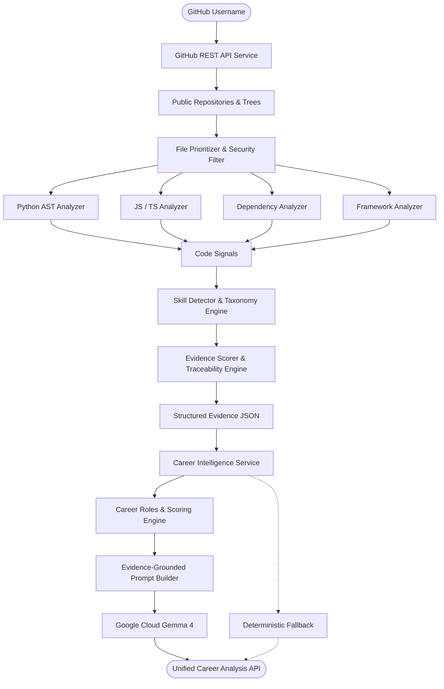

# ProofPath

> **Deterministic Skill Proof Extraction Engine & Career Intelligence powered by Google Cloud Gemma 4**  
> *Core Principle: NO EVIDENCE → NO CLAIM*  
> *Motto: Code proves. AI interprets.*

---

## Team

**Team Name:** Rebels

| Member | Contribution |
| ------ | ------------ |
| Varun Shankar | Team Leader & System Design |
| Dheeraj Kumar Reddy | Core Backend, AST Analyzers & Evidence Engine |
| Vishnu Vardhan Reddy | API Integration, Career Service & Testing |
| Mohith Kumar Naidu | Skill Taxonomy, Roles Architecture & Gemma 4 Integration |

---

## Problem Statement

### The Problem
Traditional developer resumes, LinkedIn profiles, and GitHub summaries rely on self-declared claims and unverified badges. Tech recruiters and engineering managers waste significant time reviewing candidates who list technologies they barely used or only copied from starter templates. Furthermore, generic LLM-based profile summary tools often summarize README text files blindly, hallucinating proficiency where no real code exists.

### Why We Chose This Problem
Software engineering is inherently practical. An engineer's real competence is reflected in the code they write, how they design classes, import libraries, configure pipelines, and test software. We chose this problem to build a tamper-resistant, deterministic verification engine that bridges candidate claims with verifiable code evidence, paired with grounded AI reasoning to evaluate career role readiness.

---

## Solution

ProofPath inspects a developer's public GitHub repositories, deterministically verifies technical skills directly against source code, maps those skills to industry career roles with weighted readiness scoring, and generates evidence-grounded career insights using **Google Cloud Managed Gemma 4**.

### Complete End-to-End Pipeline
```text
GitHub Profile
      ↓
Public Repositories
      ↓
Repository File Trees
      ↓
Security & Binary Filtering
      ↓
Source Code Analysis (Python AST, JS/TS Tokenizer, Manifests)
      ↓
Signal Extraction & Aggregation
      ↓
Skill Taxonomy Matching (data/skills.json)
      ↓
Evidence Level Scoring (0–5) & Line Traceability
      ↓
Structured Evidence JSON (Phase 1)
      ↓
Career Role Matching (data/roles.json)
      ↓
Deterministic Weighted Readiness Scoring (Core 2.0x, Supporting 1.0x)
      ↓
Skill Classification (Proven / Partial / Missing)
      ↓
Google Cloud Managed Gemma 4 (gemma-4-26b-a4b-it-maas)
      ↓
Evidence-Grounded Career Assessment & Fallback
      ↓
Unified Career Intelligence Response (Phase 2)
```

### Key Features
- **Deterministic AST Analysis:** Uses Python's built-in `ast` module to analyze class inheritance, function calls, training loops, and API decorators without executing code.
- **JavaScript & TypeScript Extraction:** Parses React components, hooks, Express handlers, TypeScript types, and async workflows.
- **Calibrated Evidence Scale (0–5):** Distinguishes between documentation mentions (Level 1), dependency manifests (Level 2), code implementation (Level 3), applied integration (Level 4), and production readiness (Level 5).
- **Exact Line Traceability:** Every claimed skill points back to specific repository files and line numbers.
- **Data-Driven Career Roles:** Maps skills to 6 industry roles (*Machine Learning Engineer, Full Stack Developer, Data Scientist, Backend Engineer, AI Engineer, Frontend Developer*) with explicit core (2.0) and supporting (1.0) weights.
- **Strictly Deterministic Readiness Scoring:** Readiness scores (0–100%) are mathematically computed. AI is never permitted to fabricate or override technical evidence.
- **Google Cloud Managed Gemma 4 (`gemma-4-26b-a4b-it-maas`):** Evidence-grounded inference translates physical code signals into actionable strengths, gaps, and recommendations.
- **Resilient AI Failure Fallback:** If Gemma 4 is unreachable or unconfigured, the system seamlessly produces a deterministic, traceable assessment without crashing.

---

## Innovation and Differentiation

| Feature | Conventional Resume/AI Tools | ProofPath |
| ------- | ---------------------------- | --------- |
| **Evidence Basis** | Self-reported or README text | Physical repository source code |
| **Analysis Method** | LLM summarization (hallucinates) | Deterministic AST & manifest parsing |
| **Traceability** | None (opaque assertions) | Exact file path and line numbers |
| **Dependency Weight** | Treated as full skill | Strictly Level 2 (Partial Evidence) |
| **Career Readiness** | Subjective keyword match | Mathematically weighted scoring (Core 2.0x, Supporting 1.0x) |
| **AI Role** | Generates claims from thin air | Strictly interprets pre-verified code evidence |
| **AI Resilience** | System breaks if LLM errors | Graceful deterministic fallback ensures 100% uptime |
| **Security** | Often runs untrusted code | 100% read-only static analysis |

---

## Technical Implementation

### Architecture


### Technology Stack

| Category | Technologies |
| -------- | ------------ |
| Frontend | N/A (Backend Core Engine for Phase 1 & 2) |
| Backend | Python 3.10+, FastAPI, Uvicorn, Pydantic v2 |
| HTTP Client | HTTPX (async client with timeouts & rate-limit handling) |
| Code Parsing | Python `ast`, Regex Lexer, JSON/TOML parsers |
| AI Model | Google Cloud Managed Gemma 4 (`gemma-4-26b-a4b-it-maas`, location: `global`) |
| Infrastructure | Uvicorn ASGI Server, Virtualenv |
| External APIs | GitHub REST API (v3), Google Cloud Vertex AI / Generative Language API |

---

## Implementation During the Hackathon

During Hack Day, the Rebels team built:

### Phase 1: Proof Extraction Engine
- Asynchronous `GitHubService` with automatic rate limit handling, tree queries, and fallback scraping.
- `RepositoryService` with strict file prioritization and security filtering.
- AST-based `PythonAnalyzer` for deep call/decorator/inheritance signal extraction.
- `JavaScriptAnalyzer` and `DependencyAnalyzer` supporting modern front/backend frameworks.
- Data-driven `data/skills.json` taxonomy covering 22 core engineering technologies.
- `SkillDetector` with Level 0–5 calibrated scoring and deduplication.

### Phase 2: Career Intelligence & Gemma 4 Integration
- Career roles specification in `data/roles.json` with core and supporting weights across 6 key roles.
- `CareerService` implementing deterministic readiness scoring, skill classification (Proven/Partial/Missing), and primary role matching.
- `PromptBuilder` embedding strict `NO EVIDENCE -> NO CLAIM` grounding instructions and structured JSON output schemas.
- `GemmaService` connecting to Google Cloud Managed Gemma 4 (`gemma-4-26b-a4b-it-maas`, location `global`).
- Robust deterministic fallback ensuring 100% availability even when AI is unconfigured or offline.
- Extended FastAPI routers (`POST /api/analysis/career`, `GET /api/analysis/roles`, `GET /api/analysis/roles/{role_id}`).
- Comprehensive test suite of **45 unit and integration tests** passing with 100% success rate.

---

## Open Source and AI Usage

### AI / Models
- **Google Cloud Managed Gemma 4 (`gemma-4-26b-a4b-it-maas`):**
  - **Role:** Generates evidence-grounded qualitative career insights (strengths, gaps, actionable recommendations) based solely on verified Phase 1 code signals.
  - **Deployment:** Google Cloud Vertex AI Model Garden / MaaS (`global` location).
  - **Grounding Guardrails:** Gemma is strictly prohibited from altering deterministic readiness scores or inventing unverified skill claims.

### Open Source Components
- **FastAPI:** High-performance web framework for the ProofPath REST API.
- **HTTPX:** Async HTTP client for GitHub API communication and Vertex AI REST requests.
- **Pydantic v2:** Robust data validation, schema definitions, and model serialization.
- **Pytest & Pytest-Asyncio:** Test execution and async test fixture harness.
- **Python-dotenv:** Secure environment configuration management.

---

## Setup and Usage

### Prerequisites
- Python 3.10 or higher
- Git
- Internet connection (for GitHub API and Google Cloud access)

### Installation
```bash
git clone <repository-url>
cd hack

# Create and activate virtual environment
python -m venv .venv

# Windows PowerShell:
.\.venv\Scripts\Activate.ps1

# Linux / macOS:
source .venv/bin/activate

# Install dependencies
pip install -r backend/requirements.txt
```

### Environment Variables
Copy `.env.example` to `.env`:
```env
# GitHub Configuration
GITHUB_TOKEN=your_optional_github_token_here
PORT=8000

# Limits
MAX_REPOSITORIES=5
MAX_FILES_PER_REPOSITORY=40
MAX_FILE_SIZE=100000
MAX_TOTAL_SOURCE_SIZE=1000000
GITHUB_API_TIMEOUT=15.0

# Google Cloud Managed Gemma 4 Configuration
GOOGLE_CLOUD_PROJECT=your-project-id
GOOGLE_CLOUD_LOCATION=global
GEMMA_MODEL=gemma-4-26b-a4b-it-maas
GEMMA_API_KEY=your_optional_gemma_api_key
GEMMA_TIMEOUT=30.0
```

### Running the Project
From the repository root:
```bash
$env:PYTHONPATH="backend"
.\.venv\Scripts\uvicorn app.main:app --reload --port 8000
```

### Running Tests
```bash
$env:PYTHONPATH="backend"
.\.venv\Scripts\python -m pytest backend/tests -v
```

### API Endpoints
- **Swagger Documentation:** `http://localhost:8000/docs`
- **Health Check:** `GET /health`
- **List Supported Roles:** `GET /api/analysis/roles`
- **Role Details:** `GET /api/analysis/roles/{role_id}`
- **Deterministic GitHub Analysis:** `POST /api/github/analyze`
- **Career Intelligence & Gemma 4 Analysis:** `POST /api/analysis/career`

#### Example Career Analysis Request
```bash
curl -X POST http://localhost:8000/api/analysis/career \
     -H "Content-Type: application/json" \
     -d '{
       "username": "torvalds",
       "role_ids": ["backend_engineer"],
       "include_ai": true
     }'
```

---

## Challenges and Learnings
- **Rate Limit Constraints:** GitHub restricts unauthenticated REST requests to 60/hour. We resolved this by querying the Git Trees API recursively (1 request per repo rather than 1 request per directory) and supporting token-based requests.
- **Untrusted Code Security:** Analyzing arbitrary user repositories could expose systems to malicious files. We implemented strict static AST parsing with a hard rule that repository code is never imported or executed.
- **AI Hallucination Containment:** LLMs tend to assume full competency from simple keywords. We constrained Gemma 4 strictly to pre-extracted code evidence and enforced an automatic deterministic fallback when external AI is offline.
- **Mathematical Role Calibration:** Balancing core requirements vs. supporting skills was solved by implementing a 2.0x / 1.0x weighted scoring formula that reliably reflects industry expectations.

---

## Credits and License

### Credits
- Built for **Hacktoberfest Hack Day — Coimbatore 2026** organized by INIT CLUB × iDEA CLUB in collaboration with Major League Hacking (MLH).
- Inspired by the open-source software verification community.

### License
This project is licensed under the MIT License.
